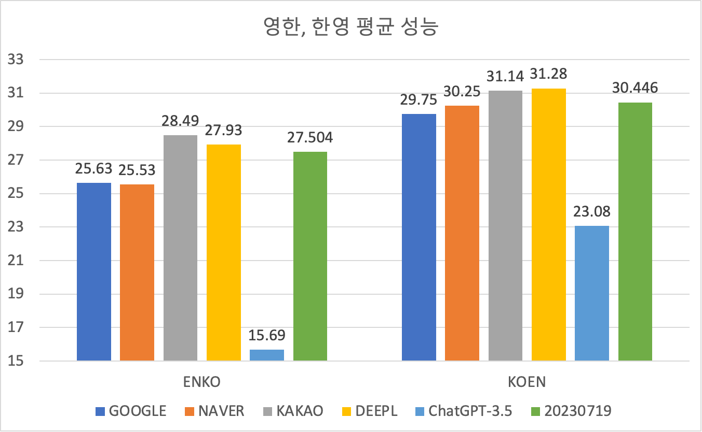

# Arxiv Translation Project

이 레포는 쏟아지는 페이퍼들에 대응하기 위하여, 빠르게 Arxiv 페이퍼를 살펴볼 수 있도록 한글화된 웹페이지를 제공하는 것을 목표로 합니다.
각기 다른 형태의 PDF 파일을 번역하기 위해서, 텍스트를 추출할 때 nougat OCR 라이브러리를 활용합니다.
따라서 추출이 원활하지 않을 수 있습니다.
처음에는 Ar5iv를 번역할까 생각했지만, Ar5iv도 한달이 지나서야 페이퍼가 업데이트 되며, 최초 버전만 HTML화 하고 최종 버전은 반영되어 있지 않기 때문에, 자체적으로 내용을 추출하기로 결정하였습니다.
정확한 내용을 파악하기 위해서는 원본 페이퍼를 읽는 것을 추천합니다.

## Paper List

새 창 열기가 지원되지 않습니다. 직접 새 창으로 열기를 통해 열기를 권장합니다.

| ArXiv ID | Title | ArXiv / Ar5iv | English / Korean |
|:--------:|-------|:-------------:|:----------------:|
| 2312.11562 | A Survey of Reasoning with Foundation Models Concepts Methodologies and Outlook | [arXiv](https://arxiv.org/abs/2312.11562) / [ar5iv](https://ar5iv.org/abs/2312.11562) | [en](https://raw.githack.com/kh-kim/arxiv-translator/master/papers/2312.11562/paper.en.html) / [ko](https://raw.githack.com/kh-kim/arxiv-translator/master/papers/2312.11562/paper.ko.html) |
| 2312.10997 | Retrieval-Augmented Generation for Large Language Models A Survey | [arXiv](https://arxiv.org/abs/2312.10997) / [ar5iv](https://ar5iv.org/abs/2312.10997) | [en](https://raw.githack.com/kh-kim/arxiv-translator/master/papers/2312.10997/paper.en.html) / [ko](https://raw.githack.com/kh-kim/arxiv-translator/master/papers/2312.10997/paper.ko.html) |
| 2312.10868 | From Google Gemini to OpenAI Q Q-Star A Survey of Reshaping the Generative Artificial Intelligence AI Research Landscape | [arXiv](https://arxiv.org/abs/2312.10868) / [ar5iv](https://ar5iv.org/abs/2312.10868) | [en](https://raw.githack.com/kh-kim/arxiv-translator/master/papers/2312.10868/paper.en.html) / [ko](https://raw.githack.com/kh-kim/arxiv-translator/master/papers/2312.10868/paper.ko.html) |
| 2312.09256 | LIME Localized Image Editing via Attention Regularization in Diffusion Models | [arXiv](https://arxiv.org/abs/2312.09256) / [ar5iv](https://ar5iv.org/abs/2312.09256) | [en](https://raw.githack.com/kh-kim/arxiv-translator/master/papers/2312.09256/paper.en.html) / [ko](https://raw.githack.com/kh-kim/arxiv-translator/master/papers/2312.09256/paper.ko.html) |
| 2312.09256 | LIME Localized Image Editing via Attention Regularization in Diffusion Models | [arXiv](https://arxiv.org/abs/2312.09256) / [ar5iv](https://ar5iv.org/abs/2312.09256) | [en](https://raw.githack.com/kh-kim/arxiv-translator/master/papers/2312.09256/paper.en.html) / [ko](https://raw.githack.com/kh-kim/arxiv-translator/master/papers/2312.09256/paper.ko.html) |
| 2312.08629 | ChatSOS LLM-based knowledge QA system for safety engineering | [arXiv](https://arxiv.org/abs/2312.08629) / [ar5iv](https://ar5iv.org/abs/2312.08629) | [en](https://raw.githack.com/kh-kim/arxiv-translator/master/papers/2312.08629/paper.en.html) / [ko](https://raw.githack.com/kh-kim/arxiv-translator/master/papers/2312.08629/paper.ko.html) |
| 2312.07910 | PromptBench A Unified Library for Evaluation of Large Language Models | [arXiv](https://arxiv.org/abs/2312.07910) / [ar5iv](https://ar5iv.org/abs/2312.07910) | [en](https://raw.githack.com/kh-kim/arxiv-translator/master/papers/2312.07910/paper.en.html) / [ko](https://raw.githack.com/kh-kim/arxiv-translator/master/papers/2312.07910/paper.ko.html) |
| 2312.07398 | LLMEval A Preliminary Study on How to Evaluate Large Language Models | [arXiv](https://arxiv.org/abs/2312.07398) / [ar5iv](https://ar5iv.org/abs/2312.07398) | [en](https://raw.githack.com/kh-kim/arxiv-translator/master/papers/2312.07398/paper.en.html) / [ko](https://raw.githack.com/kh-kim/arxiv-translator/master/papers/2312.07398/paper.ko.html) |
| 2312.06585 | Beyond Human Data Scaling Self-Training for Problem-Solving with Language Models | [arXiv](https://arxiv.org/abs/2312.06585) / [ar5iv](https://ar5iv.org/abs/2312.06585) | [en](https://raw.githack.com/kh-kim/arxiv-translator/master/papers/2312.06585/paper.en.html) / [ko](https://raw.githack.com/kh-kim/arxiv-translator/master/papers/2312.06585/paper.ko.html) |
| 2312.04474 | Chain of Code Reasoning with a Language Model-Augmented Code Emulator | [arXiv](https://arxiv.org/abs/2312.04474) / [ar5iv](https://ar5iv.org/abs/2312.04474) | [en](https://raw.githack.com/kh-kim/arxiv-translator/master/papers/2312.04474/paper.en.html) / [ko](https://raw.githack.com/kh-kim/arxiv-translator/master/papers/2312.04474/paper.ko.html) |
| 2312.02783 | Large Language Models on Graphs A Comprehensive Survey | [arXiv](https://arxiv.org/abs/2312.02783) / [ar5iv](https://ar5iv.org/abs/2312.02783) | [en](https://raw.githack.com/kh-kim/arxiv-translator/master/papers/2312.02783/paper.en.html) / [ko](https://raw.githack.com/kh-kim/arxiv-translator/master/papers/2312.02783/paper.ko.html) |
| 2312.01454 | D-Bot Database Diagnosis System using Large Language Models | [arXiv](https://arxiv.org/abs/2312.01454) / [ar5iv](https://ar5iv.org/abs/2312.01454) | [en](https://raw.githack.com/kh-kim/arxiv-translator/master/papers/2312.01454/paper.en.html) / [ko](https://raw.githack.com/kh-kim/arxiv-translator/master/papers/2312.01454/paper.ko.html) |
| 2312.00752 | Mamba Linear-Time Sequence Modeling with Selective State Spaces | [arXiv](https://arxiv.org/abs/2312.00752) / [ar5iv](https://ar5iv.org/abs/2312.00752) | [en](https://raw.githack.com/kh-kim/arxiv-translator/master/papers/2312.00752/paper.en.html) / [ko](https://raw.githack.com/kh-kim/arxiv-translator/master/papers/2312.00752/paper.ko.html) |
| 2312.00678 | The Efficiency Spectrum of Large Language Models An Algorithmic Survey | [arXiv](https://arxiv.org/abs/2312.00678) / [ar5iv](https://ar5iv.org/abs/2312.00678) | [en](https://raw.githack.com/kh-kim/arxiv-translator/master/papers/2312.00678/paper.en.html) / [ko](https://raw.githack.com/kh-kim/arxiv-translator/master/papers/2312.00678/paper.ko.html) |
| 2311.16867 | The Falcon Series of Open Language Models | [arXiv](https://arxiv.org/abs/2311.16867) / [ar5iv](https://ar5iv.org/abs/2311.16867) | [en](https://raw.githack.com/kh-kim/arxiv-translator/master/papers/2311.16867/paper.en.html) / [ko](https://raw.githack.com/kh-kim/arxiv-translator/master/papers/2311.16867/paper.ko.html) |
| 2311.13165 | Multimodal Large Language Models A Survey | [arXiv](https://arxiv.org/abs/2311.13165) / [ar5iv](https://ar5iv.org/abs/2311.13165) | [en](https://raw.githack.com/kh-kim/arxiv-translator/master/papers/2311.13165/paper.en.html) / [ko](https://raw.githack.com/kh-kim/arxiv-translator/master/papers/2311.13165/paper.ko.html) |
| 2311.11045 | Orca 2 Teaching Small Language Models How to Reason | [arXiv](https://arxiv.org/abs/2311.11045) / [ar5iv](https://ar5iv.org/abs/2311.11045) | [en](https://raw.githack.com/kh-kim/arxiv-translator/master/papers/2311.11045/paper.en.html) / [ko](https://raw.githack.com/kh-kim/arxiv-translator/master/papers/2311.11045/paper.ko.html) |
| 2311.10770 | Exponentially Faster Language Modelling | [arXiv](https://arxiv.org/abs/2311.10770) / [ar5iv](https://ar5iv.org/abs/2311.10770) | [en](https://raw.githack.com/kh-kim/arxiv-translator/master/papers/2311.10770/paper.en.html) / [ko](https://raw.githack.com/kh-kim/arxiv-translator/master/papers/2311.10770/paper.ko.html) |
| 2311.08355 | Mustango Toward Controllable Text-to-Music Generation | [arXiv](https://arxiv.org/abs/2311.08355) / [ar5iv](https://ar5iv.org/abs/2311.08355) | [en](https://raw.githack.com/kh-kim/arxiv-translator/master/papers/2311.08355/paper.en.html) / [ko](https://raw.githack.com/kh-kim/arxiv-translator/master/papers/2311.08355/paper.ko.html) |
| 2311.08355 | Mustango Toward Controllable Text-to-Music Generation | [arXiv](https://arxiv.org/abs/2311.08355) / [ar5iv](https://ar5iv.org/abs/2311.08355) | [en](https://raw.githack.com/kh-kim/arxiv-translator/master/papers/2311.08355/paper.en.html) / [ko](https://raw.githack.com/kh-kim/arxiv-translator/master/papers/2311.08355/paper.ko.html) |
| 2311.04590 | Rethinking Cross-Domain Sequential Recommendation under Open-World Assumptions | [arXiv](https://arxiv.org/abs/2311.04590) / [ar5iv](https://ar5iv.org/abs/2311.04590) | [en](https://raw.githack.com/kh-kim/arxiv-translator/master/papers/2311.04590/paper.en.html) / [ko](https://raw.githack.com/kh-kim/arxiv-translator/master/papers/2311.04590/paper.ko.html) |
| 2310.08659 | LoftQ LoRA-Fine-Tuning-Aware Quantization for Large Language Models | [arXiv](https://arxiv.org/abs/2310.08659) / [ar5iv](https://ar5iv.org/abs/2310.08659) | [en](https://raw.githack.com/kh-kim/arxiv-translator/master/papers/2310.08659/paper.en.html) / [ko](https://raw.githack.com/kh-kim/arxiv-translator/master/papers/2310.08659/paper.ko.html) |
| 2310.04678 | DORIS-MAE Scientific Document Retrieval using Multi-level Aspect-based Queries | [arXiv](https://arxiv.org/abs/2310.04678) / [ar5iv](https://ar5iv.org/abs/2310.04678) | [en](https://raw.githack.com/kh-kim/arxiv-translator/master/papers/2310.04678/paper.en.html) / [ko](https://raw.githack.com/kh-kim/arxiv-translator/master/papers/2310.04678/paper.ko.html) |
| 2310.04406 | Language Agent Tree Search Unifies Reasoning Acting and Planning in Language Models | [arXiv](https://arxiv.org/abs/2310.04406) / [ar5iv](https://ar5iv.org/abs/2310.04406) | [en](https://raw.githack.com/kh-kim/arxiv-translator/master/papers/2310.04406/paper.en.html) / [ko](https://raw.githack.com/kh-kim/arxiv-translator/master/papers/2310.04406/paper.ko.html) |
| 2310.03813 | Accurate Cold-start Bundle Recommendation via Popularity-based Coalescence and Curriculum Heating | [arXiv](https://arxiv.org/abs/2310.03813) / [ar5iv](https://ar5iv.org/abs/2310.03813) | [en](https://raw.githack.com/kh-kim/arxiv-translator/master/papers/2310.03813/paper.en.html) / [ko](https://raw.githack.com/kh-kim/arxiv-translator/master/papers/2310.03813/paper.ko.html) |
| 2309.16039 | Effective Long-Context Scaling of Foundation Models | [arXiv](https://arxiv.org/abs/2309.16039) / [ar5iv](https://ar5iv.org/abs/2309.16039) | [en](https://raw.githack.com/kh-kim/arxiv-translator/master/papers/2309.16039/paper.en.html) / [ko](https://raw.githack.com/kh-kim/arxiv-translator/master/papers/2309.16039/paper.ko.html) |
| 2309.15402 | A Survey of Chain of Thought Reasoning Advances Frontiers and Future | [arXiv](https://arxiv.org/abs/2309.15402) / [ar5iv](https://ar5iv.org/abs/2309.15402) | [en](https://raw.githack.com/kh-kim/arxiv-translator/master/papers/2309.15402/paper.en.html) / [ko](https://raw.githack.com/kh-kim/arxiv-translator/master/papers/2309.15402/paper.ko.html) |
| 2309.05463 | Textbooks Are All You Need II phi-15 technical report | [arXiv](https://arxiv.org/abs/2309.05463) / [ar5iv](https://ar5iv.org/abs/2309.05463) | [en](https://raw.githack.com/kh-kim/arxiv-translator/master/papers/2309.05463/paper.en.html) / [ko](https://raw.githack.com/kh-kim/arxiv-translator/master/papers/2309.05463/paper.ko.html) |
| 2309.04902 | Transformers in Small Object Detection A Benchmark and Survey of State-of-the-Art | [arXiv](https://arxiv.org/abs/2309.04902) / [ar5iv](https://ar5iv.org/abs/2309.04902) | [en](https://raw.githack.com/kh-kim/arxiv-translator/master/papers/2309.04902/paper.en.html) / [ko](https://raw.githack.com/kh-kim/arxiv-translator/master/papers/2309.04902/paper.ko.html) |
| 2309.00267 | RLAIF Scaling Reinforcement Learning from Human Feedback with AI Feedback | [arXiv](https://arxiv.org/abs/2309.00267) / [ar5iv](https://ar5iv.org/abs/2309.00267) | [en](https://raw.githack.com/kh-kim/arxiv-translator/master/papers/2309.00267/paper.en.html) / [ko](https://raw.githack.com/kh-kim/arxiv-translator/master/papers/2309.00267/paper.ko.html) |
| 2308.11432 | A Survey on Large Language Model based Autonomous Agents | [arXiv](https://arxiv.org/abs/2308.11432) / [ar5iv](https://ar5iv.org/abs/2308.11432) | [en](https://raw.githack.com/kh-kim/arxiv-translator/master/papers/2308.11432/paper.en.html) / [ko](https://raw.githack.com/kh-kim/arxiv-translator/master/papers/2308.11432/paper.ko.html) |
| 2308.10848 | AgentVerse Facilitating Multi-Agent Collaboration and Exploring Emergent Behaviors | [arXiv](https://arxiv.org/abs/2308.10848) / [ar5iv](https://ar5iv.org/abs/2308.10848) | [en](https://raw.githack.com/kh-kim/arxiv-translator/master/papers/2308.10848/paper.en.html) / [ko](https://raw.githack.com/kh-kim/arxiv-translator/master/papers/2308.10848/paper.ko.html) |
| 2308.04014 | Continual Pre-Training of Large Language Models How to rewarm your model? | [arXiv](https://arxiv.org/abs/2308.04014) / [ar5iv](https://ar5iv.org/abs/2308.04014) | [en](https://raw.githack.com/kh-kim/arxiv-translator/master/papers/2308.04014/paper.en.html) / [ko](https://raw.githack.com/kh-kim/arxiv-translator/master/papers/2308.04014/paper.ko.html) |
| 2307.14334 | Towards Generalist Biomedical AI | [arXiv](https://arxiv.org/abs/2307.14334) / [ar5iv](https://ar5iv.org/abs/2307.14334) | [en](https://raw.githack.com/kh-kim/arxiv-translator/master/papers/2307.14334/paper.en.html) / [ko](https://raw.githack.com/kh-kim/arxiv-translator/master/papers/2307.14334/paper.ko.html) |
| 2307.03172 | Lost in the Middle How Language Models Use Long Contexts | [arXiv](https://arxiv.org/abs/2307.03172) / [ar5iv](https://ar5iv.org/abs/2307.03172) | [en](https://raw.githack.com/kh-kim/arxiv-translator/master/papers/2307.03172/paper.en.html) / [ko](https://raw.githack.com/kh-kim/arxiv-translator/master/papers/2307.03172/paper.ko.html) |
| 2306.14462 | Multi-task Item-attribute Graph Pre-training for Strict Cold-start Item Recommendation | [arXiv](https://arxiv.org/abs/2306.14462) / [ar5iv](https://ar5iv.org/abs/2306.14462) | [en](https://raw.githack.com/kh-kim/arxiv-translator/master/papers/2306.14462/paper.en.html) / [ko](https://raw.githack.com/kh-kim/arxiv-translator/master/papers/2306.14462/paper.ko.html) |
| 2306.13549 | A Survey on Multimodal Large Language Models | [arXiv](https://arxiv.org/abs/2306.13549) / [ar5iv](https://ar5iv.org/abs/2306.13549) | [en](https://raw.githack.com/kh-kim/arxiv-translator/master/papers/2306.13549/paper.en.html) / [ko](https://raw.githack.com/kh-kim/arxiv-translator/master/papers/2306.13549/paper.ko.html) |
| 2306.12509 | Joint Prompt Optimization of Stacked LLMs using Variational Inference | [arXiv](https://arxiv.org/abs/2306.12509) / [ar5iv](https://ar5iv.org/abs/2306.12509) | [en](https://raw.githack.com/kh-kim/arxiv-translator/master/papers/2306.12509/paper.en.html) / [ko](https://raw.githack.com/kh-kim/arxiv-translator/master/papers/2306.12509/paper.ko.html) |
| 2306.11167 | Large Language Models are Fixated by Red Herrings Exploring Creative Problem Solving and Einstellung Effect using the Only Connect Wall Dataset | [arXiv](https://arxiv.org/abs/2306.11167) / [ar5iv](https://ar5iv.org/abs/2306.11167) | [en](https://raw.githack.com/kh-kim/arxiv-translator/master/papers/2306.11167/paper.en.html) / [ko](https://raw.githack.com/kh-kim/arxiv-translator/master/papers/2306.11167/paper.ko.html) |
| 2306.04833 | Unified Embedding Based Personalized Retrieval in Etsy Search | [arXiv](https://arxiv.org/abs/2306.04833) / [ar5iv](https://ar5iv.org/abs/2306.04833) | [en](https://raw.githack.com/kh-kim/arxiv-translator/master/papers/2306.04833/paper.en.html) / [ko](https://raw.githack.com/kh-kim/arxiv-translator/master/papers/2306.04833/paper.ko.html) |
| 2306.03361 | WHAT WHEN and HOW to Ground Designing User Persona-Aware Conversational Agents for Engaging Dialogue | [arXiv](https://arxiv.org/abs/2306.03361) / [ar5iv](https://ar5iv.org/abs/2306.03361) | [en](https://raw.githack.com/kh-kim/arxiv-translator/master/papers/2306.03361/paper.en.html) / [ko](https://raw.githack.com/kh-kim/arxiv-translator/master/papers/2306.03361/paper.ko.html) |
| 2305.18395 | Knowledge-Augmented Reasoning Distillation for Small Language Models in Knowledge-Intensive Tasks | [arXiv](https://arxiv.org/abs/2305.18395) / [ar5iv](https://ar5iv.org/abs/2305.18395) | [en](https://raw.githack.com/kh-kim/arxiv-translator/master/papers/2305.18395/paper.en.html) / [ko](https://raw.githack.com/kh-kim/arxiv-translator/master/papers/2305.18395/paper.ko.html) |
| 2305.18290 | Direct Preference Optimization Your Language Model is Secretly a Reward Model | [arXiv](https://arxiv.org/abs/2305.18290) / [ar5iv](https://ar5iv.org/abs/2305.18290) | [en](https://raw.githack.com/kh-kim/arxiv-translator/master/papers/2305.18290/paper.en.html) / [ko](https://raw.githack.com/kh-kim/arxiv-translator/master/papers/2305.18290/paper.ko.html) |
| 2305.14992 | Reasoning with Language Model is Planning with World Model | [arXiv](https://arxiv.org/abs/2305.14992) / [ar5iv](https://ar5iv.org/abs/2305.14992) | [en](https://raw.githack.com/kh-kim/arxiv-translator/master/papers/2305.14992/paper.en.html) / [ko](https://raw.githack.com/kh-kim/arxiv-translator/master/papers/2305.14992/paper.ko.html) |
| 2305.14314 | QLoRA Efficient Finetuning of Quantized LLMs | [arXiv](https://arxiv.org/abs/2305.14314) / [ar5iv](https://ar5iv.org/abs/2305.14314) | [en](https://raw.githack.com/kh-kim/arxiv-translator/master/papers/2305.14314/paper.en.html) / [ko](https://raw.githack.com/kh-kim/arxiv-translator/master/papers/2305.14314/paper.ko.html) |
| 2305.10601 | Tree of Thoughts Deliberate Problem Solving with Large Language Models | [arXiv](https://arxiv.org/abs/2305.10601) / [ar5iv](https://ar5iv.org/abs/2305.10601) | [en](https://raw.githack.com/kh-kim/arxiv-translator/master/papers/2305.10601/paper.en.html) / [ko](https://raw.githack.com/kh-kim/arxiv-translator/master/papers/2305.10601/paper.ko.html) |
| 2304.12244 | WizardLM Empowering Large Language Models to Follow Complex Instructions | [arXiv](https://arxiv.org/abs/2304.12244) / [ar5iv](https://ar5iv.org/abs/2304.12244) | [en](https://raw.githack.com/kh-kim/arxiv-translator/master/papers/2304.12244/paper.en.html) / [ko](https://raw.githack.com/kh-kim/arxiv-translator/master/papers/2304.12244/paper.ko.html) |
| 2303.18223 | A Survey of Large Language Models | [arXiv](https://arxiv.org/abs/2303.18223) / [ar5iv](https://ar5iv.org/abs/2303.18223) | [en](https://raw.githack.com/kh-kim/arxiv-translator/master/papers/2303.18223/paper.en.html) / [ko](https://raw.githack.com/kh-kim/arxiv-translator/master/papers/2303.18223/paper.ko.html) |
| 2303.16755 | Training Language Models with Language Feedback at Scale | [arXiv](https://arxiv.org/abs/2303.16755) / [ar5iv](https://ar5iv.org/abs/2303.16755) | [en](https://raw.githack.com/kh-kim/arxiv-translator/master/papers/2303.16755/paper.en.html) / [ko](https://raw.githack.com/kh-kim/arxiv-translator/master/papers/2303.16755/paper.ko.html) |
| 2212.09147 | Achiral dielectric metasurfaces for spectral and polarization control of valley specific light emission from monolayer MoS2 | [arXiv](https://arxiv.org/abs/2212.09147) / [ar5iv](https://ar5iv.org/abs/2212.09147) | [en](https://raw.githack.com/kh-kim/arxiv-translator/master/papers/2212.09147/paper.en.html) / [ko](https://raw.githack.com/kh-kim/arxiv-translator/master/papers/2212.09147/paper.ko.html) |
| 2210.03629 | ReAct Synergizing Reasoning and Acting in Language Models | [arXiv](https://arxiv.org/abs/2210.03629) / [ar5iv](https://ar5iv.org/abs/2210.03629) | [en](https://raw.githack.com/kh-kim/arxiv-translator/master/papers/2210.03629/paper.en.html) / [ko](https://raw.githack.com/kh-kim/arxiv-translator/master/papers/2210.03629/paper.ko.html) |
| 2207.14255 | Efficient Training of Language Models to Fill in the Middle | [arXiv](https://arxiv.org/abs/2207.14255) / [ar5iv](https://ar5iv.org/abs/2207.14255) | [en](https://raw.githack.com/kh-kim/arxiv-translator/master/papers/2207.14255/paper.en.html) / [ko](https://raw.githack.com/kh-kim/arxiv-translator/master/papers/2207.14255/paper.ko.html) |
| 2205.14193 | 2 Active metasurfaces lighting the path to commercial success | [arXiv](https://arxiv.org/abs/2205.14193) / [ar5iv](https://ar5iv.org/abs/2205.14193) | [en](https://raw.githack.com/kh-kim/arxiv-translator/master/papers/2205.14193/paper.en.html) / [ko](https://raw.githack.com/kh-kim/arxiv-translator/master/papers/2205.14193/paper.ko.html) |
| 2204.10365 | Towards an Enhanced Understanding of Bias in Pre-trained Neural Language Models A Survey with Special Emphasis on Affective Bias | [arXiv](https://arxiv.org/abs/2204.10365) / [ar5iv](https://ar5iv.org/abs/2204.10365) | [en](https://raw.githack.com/kh-kim/arxiv-translator/master/papers/2204.10365/paper.en.html) / [ko](https://raw.githack.com/kh-kim/arxiv-translator/master/papers/2204.10365/paper.ko.html) |
| 2203.14473 | Towards Dynamic and Safe Configuration Tuning for Cloud Databases | [arXiv](https://arxiv.org/abs/2203.14473) / [ar5iv](https://ar5iv.org/abs/2203.14473) | [en](https://raw.githack.com/kh-kim/arxiv-translator/master/papers/2203.14473/paper.en.html) / [ko](https://raw.githack.com/kh-kim/arxiv-translator/master/papers/2203.14473/paper.ko.html) |
| 2203.11171 | Self-Consistency Improves Chain of Thought Reasoning in Language Models | [arXiv](https://arxiv.org/abs/2203.11171) / [ar5iv](https://ar5iv.org/abs/2203.11171) | [en](https://raw.githack.com/kh-kim/arxiv-translator/master/papers/2203.11171/paper.en.html) / [ko](https://raw.githack.com/kh-kim/arxiv-translator/master/papers/2203.11171/paper.ko.html) |
| 2202.06991 | Transformer Memory as a Differentiable Search Index | [arXiv](https://arxiv.org/abs/2202.06991) / [ar5iv](https://ar5iv.org/abs/2202.06991) | [en](https://raw.githack.com/kh-kim/arxiv-translator/master/papers/2202.06991/paper.en.html) / [ko](https://raw.githack.com/kh-kim/arxiv-translator/master/papers/2202.06991/paper.ko.html) |
| 2201.11903 | Chain-of-Thought Prompting Elicits Reasoning in Large Language Models | [arXiv](https://arxiv.org/abs/2201.11903) / [ar5iv](https://ar5iv.org/abs/2201.11903) | [en](https://raw.githack.com/kh-kim/arxiv-translator/master/papers/2201.11903/paper.en.html) / [ko](https://raw.githack.com/kh-kim/arxiv-translator/master/papers/2201.11903/paper.ko.html) |
| 2112.02300 | Unsupervised Domain Generalization by Learning a Bridge Across Domains | [arXiv](https://arxiv.org/abs/2112.02300) / [ar5iv](https://ar5iv.org/abs/2112.02300) | [en](https://raw.githack.com/kh-kim/arxiv-translator/master/papers/2112.02300/paper.en.html) / [ko](https://raw.githack.com/kh-kim/arxiv-translator/master/papers/2112.02300/paper.ko.html) |
| 2108.13475 | An Analysis Of Entire Space Multi-Task Models For Post-Click Conversion Prediction | [arXiv](https://arxiv.org/abs/2108.13475) / [ar5iv](https://ar5iv.org/abs/2108.13475) | [en](https://raw.githack.com/kh-kim/arxiv-translator/master/papers/2108.13475/paper.en.html) / [ko](https://raw.githack.com/kh-kim/arxiv-translator/master/papers/2108.13475/paper.ko.html) |
| 2106.09685 | LoRA Low-Rank Adaptation of Large Language Models | [arXiv](https://arxiv.org/abs/2106.09685) / [ar5iv](https://ar5iv.org/abs/2106.09685) | [en](https://raw.githack.com/kh-kim/arxiv-translator/master/papers/2106.09685/paper.en.html) / [ko](https://raw.githack.com/kh-kim/arxiv-translator/master/papers/2106.09685/paper.ko.html) |
| 2101.03961 | Switch Transformers Scaling to Trillion Parameter Models with Simple and Efficient Sparsity | [arXiv](https://arxiv.org/abs/2101.03961) / [ar5iv](https://ar5iv.org/abs/2101.03961) | [en](https://raw.githack.com/kh-kim/arxiv-translator/master/papers/2101.03961/paper.en.html) / [ko](https://raw.githack.com/kh-kim/arxiv-translator/master/papers/2101.03961/paper.ko.html) |
| 2007.01282 | Leveraging Passage Retrieval with Generative Models for Open Domain Question Answering | [arXiv](https://arxiv.org/abs/2007.01282) / [ar5iv](https://ar5iv.org/abs/2007.01282) | [en](https://raw.githack.com/kh-kim/arxiv-translator/master/papers/2007.01282/paper.en.html) / [ko](https://raw.githack.com/kh-kim/arxiv-translator/master/papers/2007.01282/paper.ko.html) |
| 2005.11401 | Retrieval-Augmented Generation for Knowledge-Intensive NLP Tasks | [arXiv](https://arxiv.org/abs/2005.11401) / [ar5iv](https://ar5iv.org/abs/2005.11401) | [en](https://raw.githack.com/kh-kim/arxiv-translator/master/papers/2005.11401/paper.en.html) / [ko](https://raw.githack.com/kh-kim/arxiv-translator/master/papers/2005.11401/paper.ko.html) |
| 2004.04906 | Dense Passage Retrieval for Open-Domain Question Answering | [arXiv](https://arxiv.org/abs/2004.04906) / [ar5iv](https://ar5iv.org/abs/2004.04906) | [en](https://raw.githack.com/kh-kim/arxiv-translator/master/papers/2004.04906/paper.en.html) / [ko](https://raw.githack.com/kh-kim/arxiv-translator/master/papers/2004.04906/paper.ko.html) |
| 2002.08909 | REALM Retrieval-Augmented Language Model Pre-Training | [arXiv](https://arxiv.org/abs/2002.08909) / [ar5iv](https://ar5iv.org/abs/2002.08909) | [en](https://raw.githack.com/kh-kim/arxiv-translator/master/papers/2002.08909/paper.en.html) / [ko](https://raw.githack.com/kh-kim/arxiv-translator/master/papers/2002.08909/paper.ko.html) |
| 2002.06563 | Epidemic analysis of COVID-19 in China by dynamical modeling | [arXiv](https://arxiv.org/abs/2002.06563) / [ar5iv](https://ar5iv.org/abs/2002.06563) | [en](https://raw.githack.com/kh-kim/arxiv-translator/master/papers/2002.06563/paper.en.html) / [ko](https://raw.githack.com/kh-kim/arxiv-translator/master/papers/2002.06563/paper.ko.html) |
| 2001.09592 | Finding Security Vulnerabilities in Network Protocol Implementations | [arXiv](https://arxiv.org/abs/2001.09592) / [ar5iv](https://ar5iv.org/abs/2001.09592) | [en](https://raw.githack.com/kh-kim/arxiv-translator/master/papers/2001.09592/paper.en.html) / [ko](https://raw.githack.com/kh-kim/arxiv-translator/master/papers/2001.09592/paper.ko.html) |
| 1910.10683 | Exploring the Limits of Transfer Learning with a Unified Text-to-Text Transformer | [arXiv](https://arxiv.org/abs/1910.10683) / [ar5iv](https://ar5iv.org/abs/1910.10683) | [en](https://raw.githack.com/kh-kim/arxiv-translator/master/papers/1910.10683/paper.en.html) / [ko](https://raw.githack.com/kh-kim/arxiv-translator/master/papers/1910.10683/paper.ko.html) |
| 1910.07099 | Entire Space Multi-Task Modeling via Post-Click Behavior Decomposition for Conversion Rate Prediction | [arXiv](https://arxiv.org/abs/1910.07099) / [ar5iv](https://ar5iv.org/abs/1910.07099) | [en](https://raw.githack.com/kh-kim/arxiv-translator/master/papers/1910.07099/paper.en.html) / [ko](https://raw.githack.com/kh-kim/arxiv-translator/master/papers/1910.07099/paper.ko.html) |
| 1801.01207 | Meltdown | [arXiv](https://arxiv.org/abs/1801.01207) / [ar5iv](https://ar5iv.org/abs/1801.01207) | [en](https://raw.githack.com/kh-kim/arxiv-translator/master/papers/1801.01207/paper.en.html) / [ko](https://raw.githack.com/kh-kim/arxiv-translator/master/papers/1801.01207/paper.ko.html) |
| 1801.01203 | Spectre Attacks Exploiting Speculative Execution | [arXiv](https://arxiv.org/abs/1801.01203) / [ar5iv](https://ar5iv.org/abs/1801.01203) | [en](https://raw.githack.com/kh-kim/arxiv-translator/master/papers/1801.01203/paper.en.html) / [ko](https://raw.githack.com/kh-kim/arxiv-translator/master/papers/1801.01203/paper.ko.html) |
| 1706.03762 | Attention Is All You Need | [arXiv](https://arxiv.org/abs/1706.03762) / [ar5iv](https://ar5iv.org/abs/1706.03762) | [en](https://raw.githack.com/kh-kim/arxiv-translator/master/papers/1706.03762/paper.en.html) / [ko](https://raw.githack.com/kh-kim/arxiv-translator/master/papers/1706.03762/paper.ko.html) |
| 1702.08734 | Billion-scale similarity search with GPUs | [arXiv](https://arxiv.org/abs/1702.08734) / [ar5iv](https://ar5iv.org/abs/1702.08734) | [en](https://raw.githack.com/kh-kim/arxiv-translator/master/papers/1702.08734/paper.en.html) / [ko](https://raw.githack.com/kh-kim/arxiv-translator/master/papers/1702.08734/paper.ko.html) |

## Procedure

Arxiv 페이퍼를 번역하기 위해서 총 4단계를 거칩니다.

#### ArXiv Paper Download

Arxiv는 wget 등의 명령어를 통해서 pdf 파일을 다운로드 받을 수 없게 하였습니다.
아마도 무분별한 scrapping에 대응하기 위한 것으로 생각됩니다.
따라서 pdf 파일을 다운로드 받기 위해서 [arxiv-dl](https://pypi.org/project/arxiv-dl/) 패키지를 활용합니다.

#### PDF to Markdown

[Nougat OCR](https://github.com/facebookresearch/nougat)을 활용하여 Mathpix Markdown 파일로 변환합니다.

#### Translation

자체 번역 모델을 활용하여 번역을 수행합니다.
다음과 같이 페이퍼의 번역을 위해 사용된 번역기의 성능(초록색)은 DeepL과 Google, Naver의 중간쯤에 위치합니다.

#### Markdown to HTML

Mathpix Markdown을 HTML로 변환합니다.
변환 방법은 [여기](https://github.com/Mathpix/mathpix-markdown-it/tree/master?tab=readme-ov-file#using-mathpix-markdown-it-in-web-browsers)에 설명되어 있습니다.
그리고 저장된 github에 push되어 저장된 HTML 파일을 githack.com을 통해 렌더링하도록 합니다.

## Future Work

페이퍼 중간의 이미지들은 Nougat OCR에서 추출해주지 않기 때문에 빠져 있습니다.
따라서 이미지도 함께 포함하여 결과물을 만들어내도록 하고자 합니다.

## Contact

Kim Ki Hyun
pointzz.ki@gmail.com